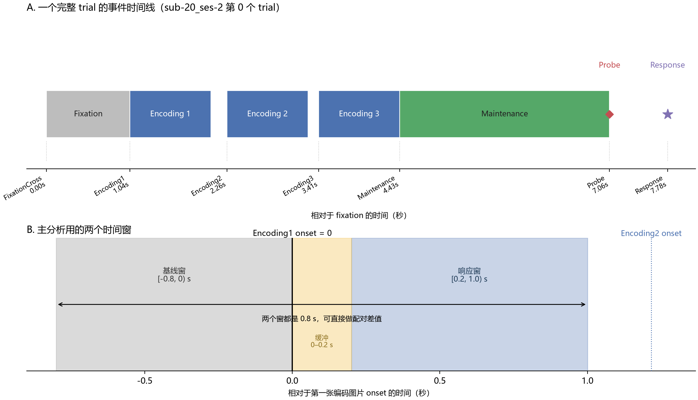
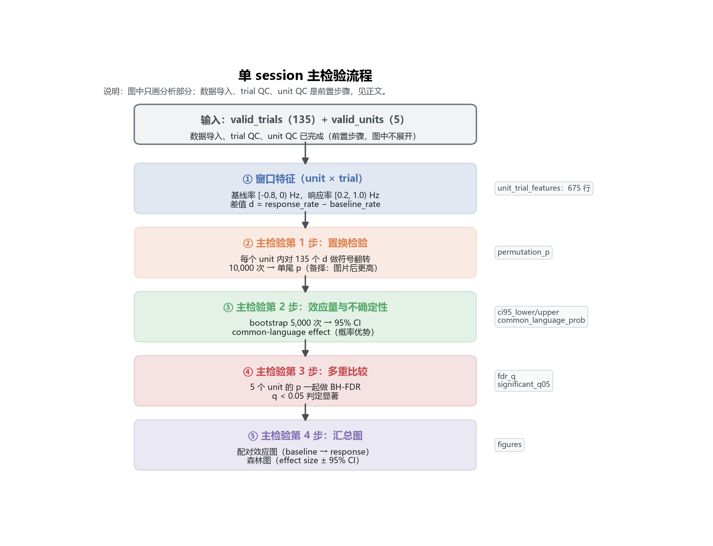
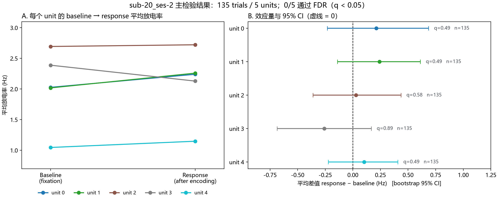
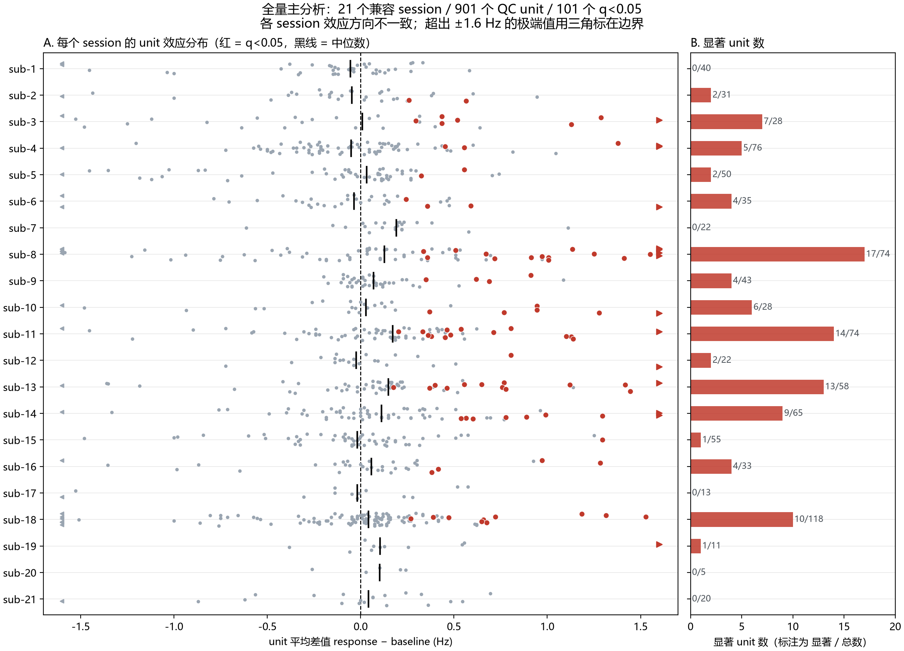

# 学习记录：DANDI 000469 Sternberg 单神经元再分析

> 配套 notebook：同目录 `read_data.ipynb`（从 `single-session-baseline/read_data.ipynb` 复制）。
> 这份记录是读完整个流程后的复盘，目标是把「做了什么、用了什么数据、数据长什么样、实验怎么做、怎么分析、全量数据多了什么、还有什么没懂」一次讲清楚。

## 1. 整体做了一个什么项目

- 这是一个**公开数据的二次分析**项目，不是自己采集数据。
- 研究对象：**人类颅内单神经元的电生理记录**（spike times）。
- 科学问题：在一个 Sternberg 工作记忆 session 内，**第一张编码图片出现后（0.2–1.0 s）的放电率，是否高于同一 trial 内图片前的 fixation 基线（-0.8–0 s）**。
- 分析单位：unit；每个 unit 内的 trial 是重复观测。
- 结论口径：只在 session 内下结论，不跨 session 合并 trial、不把 unit 当独立受试者。
- 项目分两条线：**单 session 教学**（`read_data.ipynb`）和**全量处理**（`src/` + `scripts/`，21 个兼容 session）。

### 项目文件结构

```text
Reanalysis_DANDI469_NWB/
├── single-session-baseline/   学习：单 session 教学 notebook
│   ├── README.md
│   ├── read_data.ipynb
│   ├── data_dictionary.json
│   └── unit_level_statistics.csv
├── learning-report/           学习汇报（本文件所在目录）
│   ├── learning_record.md
│   ├── read_data.ipynb
│   ├── figures/               报告用图
│   │   ├── trial_timeline.png
│   │   ├── main_test_flow.png
│   │   ├── single_session_results.png
│   │   └── all_sessions_results.png
│   └── scripts/               生成图的脚本
│       ├── make_trial_timeline.py
│       ├── make_main_test_flow.py
│       ├── make_single_session_results.py
│       └── make_all_sessions_results.py
├── raw/                       原始 NWB 输入（不提交 Git）
│   ├── all/000469/            41 个 NWB 文件
│   └── pilot-legacy/          8 个历史副本
├── src/                       分析核心（如何分析）
│   ├── data_paths.py
│   └── sternberg_primary.py
├── scripts/                   可执行入口（对哪些文件、按什么顺序）
│   ├── inventory_sessions.py
│   ├── run_primary_all.py
│   ├── run_one_session.py
│   ├── summarize_primary_v2_all.py
│   ├── plot_session_qc.py / run_representative_plots_v2.py
│   └── inventory_encoding1_picids.py / run_encoding1_picid_exploration.py
├── results/                   版本化结果
│   ├── primary-v2-all/        当前全量主结果（21 个兼容 session）
│   ├── primary-v1/            历史 4-session pilot
│   └── exploratory-v1/        图片 ID 探索
├── docs/                      顶层设计、计划、实验日志、冻结方案
├── pyproject.toml / uv.lock / .python-version   uv 环境
└── README.md
```

## 2. 用了什么数据

| 项目 | 内容 |
|---|---|
| 数据集 | DANDI 000469 *Human Single Neuron Recordings During a Working Memory Task* |
| 来源 | Rutishauser 实验室公开发布 |
| 版本 | `0.240123.1806` |
| 许可 | CC BY 4.0 |
| 数据论文 | <https://pmc.ncbi.nlm.nih.gov/articles/PMC10796636/> |
| 官方代码 | <https://github.com/rutishauserlab/workingmem-release-NWB> |
| 规模 | 21 名受试者、41 个 NWB session、约 1,809 units、约 9.8 GB |
| 本学习用的 session | `sub-20/sub-20_ses-2_ecephys+image.nwb`：135 个 trial、5 个 unit |
| 全量进入主分析的 session | 21 个（其余 20 个 `ses-1` 因缺事件字段被排除） |

- 受试者是因临床需要植入颅内微丝电极的患者。
- 数据已经预处理：只提供 spike sorting 后的 `spike_times`，没有原始宽带电压；本项目不做 sorting、不做 LFP。

## 3. 数据构成、结构与格式

**格式**：每个文件是一份 NWB 2.x 文件（底层是 HDF5）。NWB 只是「标准容器」，把 trial、事件、unit、电极按统一结构装好。

**主要内容**：

| 组 / 表 | 内容 |
|---|---|
| `session_description` / `identifier` / `session_start_time` | session 标识与起始时间；`SBID_*` = Sternberg，`SCID_*` = screening |
| `subject` | 受试者 |
| `devices` / `electrode_groups` | 设备与电极组，`location` 记录脑区 |
| `electrodes` | x, y, z, location, filtering, group, group_name, origChannel |
| `acquisition.events` | TTL 事件时间序列 |
| `trials` | 19 列：事件时间戳、记忆负荷、图片 ID、行为字段 |
| `units` | spike_times、electrodes、clusterID_orig、波形质量指标 |
| `processing` | 空 |

**字段映射（项目内名 ← 实际列名）**：

- `first_encoding_onset` ← `trials.timestamps_Encoding1`
- `fixation_event` ← `trials.timestamps_FixationCross`
- `spike_times` ← `units.spike_times`
- `region` ← `electrodes.location`

**时间**：单位秒，左闭右开；spike 与事件在同一时间轴。`fixation_event` 是**时间点**不是区间，fixation 区间大致是 `[fixation_event, encoding_onset)`。

**本 session 的 unit → 脑区**：unit 0 左侧背侧前扣带皮层；unit 1–3 右侧 pre-SMA；unit 4 右侧杏仁核。

## 4. 实验是什么样的

- 范式：**Sternberg 工作记忆任务** —— 先记住一组图片，再判断 probe 是否属于这组。
- 每个受试者两个 session：`ses-1` screening（挑图片），`ses-2` Sternberg（正式任务，图片来自 screening）。
- 刺激是图片；`loads` 表示记忆负荷（1/2/3 张编码图片）。

**一个 trial 长什么样**（`sub-20_ses-2` 第 0 个 trial，相对 fixation 的时间）：



*图：上 = 一个完整 trial 的事件时间线（以 fixation 为 0）；下 = 主分析用的两个时间窗（以第一张编码图片 onset 为 0）。由 `scripts/make_trial_timeline.py` 从 `sub-20_ses-2` 第 0 个 trial 生成。*

下表给出对应字段与相对时间：

| 阶段 | 字段 | 相对时间 |
|---|---|---|
| fixation | `timestamps_FixationCross` | 0 |
| 第 1 张编码图片 | `timestamps_Encoding1` / `_end` | 1.045 – 2.061 s |
| 第 2 张编码图片 | `timestamps_Encoding2` / `_end` | 2.261 – 3.277 s |
| 第 3 张编码图片 | `timestamps_Encoding3` / `_end` | 3.411 – 4.427 s |
| maintenance | `timestamps_Maintenance` | 4.427 – 7.056 s |
| probe | `timestamps_Probe` | … |
| response | `timestamps_Response` | 7.784 s |

- 主分析只对齐到**第 1 张编码图片**（`timestamps_Encoding1`）。
- 行为字段：`response_accuracy`、`probe_in_out`。

## 5. 单 session 分析流程（复述 `read_data.ipynb`）

流程分成两段。

**前置步骤（未画入图中）** —— 数据导入与 QC：

- 数据导入：打开 NWB 做结构检查（`trials` / `units` / `electrodes` 是否存在），建立字段映射并写数据字典。
- trial QC：时间有限、事件顺序正确、基线窗 `[-0.8, 0)` 与响应窗 `[0.2, 1.0)` 都落在 trial 内。
- unit QC：spike 时间有限且单调递增，活跃 trial ≥ 10。
- 统计前 QC：报告 ISI、零/极端计数，并画少量 raster/PSTH 核对事件对齐。

这些步骤只决定「哪些 trial / unit 有资格进入分析」，不改动原始 NWB 数据。

**主检验（下图）** —— 从窗口特征到置换检验、bootstrap、FDR 和汇总图：



*图：主检验流程（数据导入与 QC 是前置步骤，未画入图中）。由 `scripts/make_main_test_flow.py` 生成。*

## 6. 全量数据处理：与单 session 范式的异同

**相同**：每个 session 内部的统计方式完全相同，核心逻辑就是上一节的主检验。

**额外的逻辑（理论层面）**：

1. **进入分析前的筛选**：单 session 假定文件可用；全量要先判断每个文件是否符合固定的事件定义，不符合的排除并留痕。于是「分析范围」本身成了一个需要决定并记录的步骤。
2. **批量执行与审计**：从「跑一次」变成「跑很多次」，必须记录每个 session 的状态和失败/排除原因，保证没有任何一个是被静默跳过的。
3. **跨 session 汇总但不合并**：把各 session（以及 subject）的结果并排列出，但**不池化 trial、不把 unit 当独立受试者**，所以只做描述，不做总体推断。
4. **可复现性管理**：固定参数、记录输入文件的哈希、结果按版本保存且旧版本不被覆盖。
5. **一个独立的探索分支**：图片 ID 选择性是另一个问题，用独立的数据划分单独分析，与主结论分开，互不影响。

一句话：**全量 = 同一套单 session 范式 × 多个 session，外面套一层「筛选 + 批量审计 + 只描述汇总 + 版本管理」，再加一个独立探索分支。**

## 7. 结果

### 单 session（sub-20_ses-2）



*图：A = 每个 unit 的 baseline → response 平均放电率；B = 平均差值与 bootstrap 95% CI（右侧标出 q 值与 trial 数）。由 `scripts/make_single_session_results.py` 生成。*

- 5 个 unit 的 q 全部 ≥ 0.05，**0/5 显著**；95% CI 全部跨 0。
- 5 个 unit 平均差值的均值约 `0.065 Hz`，中位数约 `0.102 Hz`。
- 结论：在当前固定窗口和单尾检验下，没有足够证据支持“图片后放电率升高”；只适用于这个 session。

### 全量（21 个兼容 session）



*图：A = 每个 session 的 unit 效应分布（红点 = q<0.05，黑线 = 中位数，三角 = 超出 ±1.6 Hz 的极端值）；B = 每个 session 的显著 unit 数（标注为 显著 / 总数）。由 `scripts/make_all_sessions_results.py` 生成。*

41 个文件中 21 个 `ses-2` 进入分析，20 个 `ses-1` 因缺必需事件字段被排除。21 个 session 合计 2,672 个 trial、901 个 QC unit（仅描述规模）。

- 16 个 session 至少有一个 FDR 显著的 unit。
- 共 101 个 unit 满足 `q < 0.05`；因为备择方向是“图片后升高”，这 101 个 unit 的平均差值都为正。
- 各 session 的整体效应方向不一致：有正有负，也有多个 session 没有显著 unit。
- 结论：支持“部分 session 中存在图片后升高的 unit”，但不支持“所有 session 都增强”，也不能做跨受试者的总体推断。

## 8. 遗留的问题

- **raster 和 PSTH**：为什么一定要两张图、分别怎么读（见 notebook 第六、七段的“待解决的疑问”）。
- **QC 还不够完整**：目前是最低 QC，仍需 ISI violation、重复 unit、异常高放电 trial、波形与脑区逐条核查（部分已在统计前 QC 报告）。
- **探索性问题未做**：图片 ID（只做了探索分支）、记忆负荷、正确率、脑区效应。
- **单尾检验的边界**：只问“是否升高”，不能回答“是否降低”（unit 3 就是例子）。
- **全量 vs 单 session**：全量的汇总只做描述，如何在不池化 trial 的前提下做跨受试者推断，还没有实现。

## 9. 需要补的统计学基础

**贯穿全程**
- 描述统计（均值、中位数）
- 配对设计、重复观测
- 零假设 H0 / 备择假设 H1
- 单尾 / 双尾
- 统计独立性、伪重复（pseudoreplication）
- 非参数方法
- 置信区间的正确解释

**主检验第 1 步**
- 置换检验（permutation test）
- 配对符号翻转置换检验
- 零分布（null distribution）
- p 值、单尾 p
- 连续性校正
- 蒙特卡洛近似、随机种子

**主检验第 2 步**
- Bootstrap 重采样
- 百分位法置信区间
- 效应量、平均差 / 中位数差
- 稳健估计（中位数）
- common-language effect size（概率优势）
- 零膨胀（zero-inflation）

**主检验第 3 步**
- 多重比较问题
- 错误发现率（FDR）
- Benjamini–Hochberg 校正
- q 值、显著性阈值

**主检验第 4 步**
- 森林图（forest plot）
- 效应量 + 置信区间可视化

**全量汇总额外涉及**
- 分层/多层级数据（session、subject、unit、trial）
- 以受试者为分析单位的跨 subject 推断（本项目尚未实现）
- 训练/测试划分与数据泄漏（探索分支用到）
